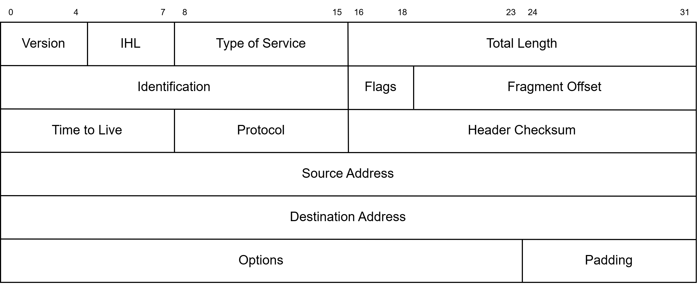
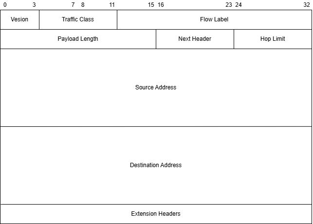

# 网络概论 


参考：
https://info.support.huawei.com/info-finder/encyclopedia/zh/IPv4.html
https://info.support.huawei.com/info-finder/encyclopedia/zh/IPv6.html
https://beej-zhcn.netdpi.net/


## 一、Socket 分类


### 1、Internet Sockets

网络中存在很多类型的socket，不过这里我们只讲解两种类型的socket，其中一种是stream sockets （流式 Sockets），另一种是Datagram Sockets（数据包格式）。

#### 1.1、Stream Sockets

Stream socket是指应用程序要传输的数据如水流一般在水管中传输一般，经由这个stream socket（如同水管）流向目的。串流式 socket 是数据会由传输层负责处理遗失、依序送达等工作，以确保应用程序所送出的数据能够可靠且依序到达。

> Stream sockets是可靠的、双向连接的通讯串流，其建立在TCP协议上。利用TCP保证数据可以依序抵达而且不会出错。


#### 1.2、Datagram Sockets

Datagram socket 是基于信息导向的方式传输数据，应用程序传输的每段数据会如邮件一般送出，由于传输数据包的路径可能会随着网络条件动态变化，每段数据抵达的顺序不一定会按照送出的顺序抵达，并且数据可能会在传输过程中丢失，而应用程序也无法知道是否传输成功。

> Datagram sockets也称为“无连接的sockets”，其建议在UDP协议上。


### 2、网络理论

计算机网络体系结构分为三种：OSI体系结构（七层）、TCP/IP体系结构（四层）、五层体系结构。

#### 2.1 OSI体系结构

OSI，一个著名的分层网络模型，**理论完善，概念清楚，但既复杂又不实用**。其分成七层，由上到下（按照与上层应用的邻近程度）依次为：

- 应用层（Application Layer）
> 网络协议的最高层，定义**应用程序（进程）间通信和交互的规则，通过进程间的交互完成特定网络任务**。
- 表示层（Presentation Layer）
> 完成传输**数据的加密和压缩**操作。
- 会话层（Session Layer）
> 网络中**会话的开始、恢复、释放与同步**
- 传输层（Transport Layer）
> 负责**为两台终端中的进程提供通信服务**，主要包含 TCP（传输控制协议）和UDP（用户数据报协议）。
- 网络层（Network Layer）
> 负责**为分组网络中的不同主机提供通信服务，并通过选择合适的路由将数据传递到目标主机**。
- 数据链路层（Data Link Layer）
> 通常简称为**链路层**，在两个相邻节点传输数据时，将网络层传输下来的 IP 数据报**封装成帧**，在两个相邻节点之间的链路上传送帧。
- 物理层（Physical Layer）
> 保证数据可以**在各种物理媒介上进行传输**，为数据的传输提供可靠的环境。

#### 2.2 TCP/IP体系结构

相较于 OSI 来说，TCP/IP是**实际运行的网络协议**，其分为四层：

- 应用层（Application Layer）
> 包含应用层、表示层和会话层
- 传输层（Transport Layer）
- 网络层（Network Layer）
- 网络接口层（Network Interface Layer）
> 包含数据链路层和物理层

#### 2.3 五层网络体系结构

五层网络体系结构**折中**了 OSI 体系结构和 TCP/IP 体系结构，常用于教学。

- 应用层（Application Layer）
> 包含应用层、表示层和会话层
- 传输层（Transport Layer）
- 网络层（Network Layer）
- 数据链路层（Data Link Layer）
- 物理层（Physical Layer）


## 二、IP 地址结构和数据转换


### 2、IPv4 和 IPv6

#### 2.1、IPv4


##### 2.1.1 基本概念

IPv4（Internet Procotol Version 4）是1981年发布的第四版互联网协议，采用**32位地址**，可提供约43亿个唯一地址，常用**点分十进制**表示。

地址示例：127.0.0.1（十进制表示），11111111.00000000.00000000.00000001（二进制表示）。
> 地址分为四段，每段取值范围在0~255之间。


##### 2.1.2 地址分类

IPv4地址根据**网络规模的不同**，将地址分为A、B、C三类，称为**主类网**。并且还定义了用于**组播寻址**的 D 类地址，以及被保留用于未来使用的 E 类地址。
> 这五类地址由 IPv4 地址的第一个字节的高位决定

- A 类地址，**首位 bit 为 0**，地址范围为 0.0.0.0 ~ 127.255.255.255，私有地址范围为 10.0.0.0 ~ 10.255.255.255。

- B 类地址，**前两位 bit 为 10**，地址范围为 128.0.0.0 ~ 192.255.255.255，私有地址范围为 172.16.0.0 ~ 172.31.255.255。

- C 类地址，**前三位 bit 为 110**，地址范围为 192.0.0.0 ~ 223.255.255.255，私有地址范围为 192.168.1.0 ~ 192.168.255.255。

- D 类地址，**前四位 bit 为 1110**，地址范围为 224.0.0.0 ~ 239.255.255.255。
> 不标识网络，用于组播寻址
- E 类地址，**前四位 bit 为 1111**，地址范围为 240.0.0.0 ~ 255.255.255.255。

##### 2.1.3 IPv4报文格式


IPv4报文格式如下：



其中，每个字段的意义如下：

- version：版本号，4 表示为 IPv4，6 表示为 IPv6

- IHL：首部长度，如果不带 option 字段，则为20，最长为 60

- Type of Service：服务类型，只有在**有 Qos 差分服务要求**时这个字段才起作用

- Total Length：总长度，**整个 IP 数据报的长度**，包括首部长度和数据之和，单位为字节，最大为 65535，总长度必须不超过最大传输单元 MTU

- Identification：标识，**主机每发一个报文就会加1**，**分片重组**时会用到该字段

- Flags：标志位，首位必须为 0（保留）；次位为 **DF（Don't Fragment）字 - 能否分片位**，0 表示可以分片，1 表示不能分片；末位为 **MF（More Fragment），表示该报文是否为最后一片**，0 表示最后一片，1 表示后面还有

- Frament Offset：片偏移，分片重组时会用到该字段。**表示在分片后，该片在原分组中的相对位置**。以 8 个字节为偏移单位

- Time to Live：存活时间，**报文在网络中的最大生存时间（最大跳数）**

- Protocol：协议，下一层协议。**指出此报文携带的数据使用何种协议**，以便目的主机的 IP 层将报文上交给哪个进程处理

- Header Checksum：首部校验和，只检验报文的首部，不检验数据部分

> IPv4 校验和计算过程：
> **初始化校验和字段**：将校验和字段的值初始化为 0。
> **分组数据**：将头部中的每一段数据按照 16 位进行分组。
> **累加数据段**：依次将这些数据段的值累加到校验和累加器中。
> **处理进位**：如果累加的和超过了 16 位，需进行进位操作，将高 16 位加到低 16 位上。
> **取反**：对累加和的最终结果进行取反，得到校验和的值。

- Source Address：源 IP 地址

- Destination Address：目的 IP 地址

- Options：**长度可变**，选项字段，**用来支持排错，测量以及安全等措施**

- Padding：**长度可变**，**填充字段，全填0**


#### 2.2、IPv6


#### 2.2.1 基本概念

IPv6（Internet Protocol Version 6）是网络层协议的第二层标准协议，其所在的网络层提供了无连接的数据传输服务。其解决了 IPv4 存在的许多不足之处，如：

- 公有IP地址数量不足
- 私有地址交流效率低
- 设备维护的路由表表项数量过大
- 不易进行自动配置和重新编址
- 安全溯源困难

IPv6 **地址长度为 128 位**，其表示形式为：X:X:X:X:X:X:X:X。128 位的 IPv6 地址被分为 8 组，每组的 16 位用 4 个十六进制字符（0~9，A~F）来表示，组和组之间用冒号（:）隔开。其中每个 “X” 表示一组十六进制数值，如下：2408:8120:A03E:0000:6719:2104:D756:C012。


#### 2.2.2 地址分类

IPv6 主要有三种地址：

- 单播地址（Unicast）：**唯一标识一个接口**，发送到单播地址的数据包将被传输到此地址所标识的唯一接口。

- 任播地址（Anycast）：用来**标识一组接口**，发送到任播地址的数据包被传输给地址所标识的一组接口中距离源节点最近的一个接口。

- 组播地址（Multicast）：用来**标识属于不同节点的一组接口**，发送的组播地址的数据包被传输给此地址所标识的所有接口。


#### 2.2.3 IPv6 数据报文格式

IPv6报文格式如下：




- Version：版本号，4 表示为 IPv4，6 表示为 IPv6

- Traffic Class：流量类别，该字段以区分业务编码点（DSCP）标记一个 IPv6 数据包，以此***指明数据包应当如何处理**

- Flow Label：流标签，该字段用于**标记 IP 数据包的一个流**。

- Payload Length：该字段表示**有效载荷的长度**，有效载荷是指紧跟 IPv6 基本报头的数据包，包含 IPv6 扩展头

- Next Header：下一报头，指明了跟随在 IPv6 基本报头后的**扩展报头的信息类型**

- Hop Limit：跳数限制，**定义了 IPv6 报文所能经过的最大跳数**

- Source Address：源地址

- Destination Address：目的地址

- Extension Headers：扩展报头，


### 3、字节顺序

网络中存在两种字节序，一种为**网络字节序**，另一种为**主机字节序**。

#### 3.1、大端字节序和小端字节序

网络字节序是**大端字节序（Big Endian）**，最高有效位存于最低内存地址处，最低有效位存于最高内存处。

主机字节序一般为**小端字节序（Little Endian）**（存在大端字节序的主机字节序），最高有效位存于最高内存地址处，最低有效位存于最低内存处。


- 判断本机字节序

```c
#include <stdio.h>

int verifyByteOrder()
{
    int i = 0; // 0x00000001 
    char *p = (char *)&i;
    // 如果读取到的第一个字节为1，则为小端，否则为大端
    return *p == 0;
}


int main()
{
    if (verifyByteOrder() == 1)
    {
        printf("Little Endian\n");
    }
    else
    {
        printf("Big Endian\n");
    }

    return 0;
}

```


#### 3.2、字节序转换函数


在数据结构`struct sockaddr_in`中，`sin_addr`和`sin_port`分别封装在包的 IP 和 UDP 层，因此，需要转换为**网络字节顺序**；而`sin_family`是被内核使用来决定在数据结构中包含什么类型的地址，因此其需为本机字节序。

```c
#include <arpa/inet.h>

// h --- host   n --- netowrk  s --- short  l --- long 

// 主机字节序 -> 网络字节序
unit16_t htons(unit16_t host_short);
unit32_t htonl(unit32_t host_long);

// 网络字节序 -> 主机字节序
unit16_t ntohs(unit16_t net_short);
unit32_t ntohl(unit32_t net__long);

```


### 4、数据结构


#### 4.1、addrinfo

`addrinfo`结构主要在网络编程解析 hostname 时使用，其包含在头文件`#include<netdb.h>`中。其定义如下：

```c
struct addrinfo{
    int ai_flags; // AI_PASSIVE, AI_CANONNAME 等
    int ai_family; // AF_INET, AF_INET6, AF_UNSPEC
    int ai_socktype; // SOCK_STREAM, SOCK_DGRAM
    int ai_protocol; // 0 - "any"
    size_t ai_addrlen; // ai_addr 的大小，单位是 byte
    struct sockaddr* ai_addr; // struct sockaddr_in or struct sockaddr_in6
    char *ai_cannonname; // hostname
    struct addrinfo *ai_next; 
};

```


#### 4.2、sockaddr


`sockaddr`在头文件`#include <sys/socket.h>`中定义，其中的sa_data中包含着目标地址和端口信息。

```c
struct sockaddr{
    unsigned short sa_family;  // 地址簇，如 AF_INET
    char sa_data[14];  // 14字节协议地址
}
```

#### 4.3、sockaddr_in

`sockaddr_in`在头文件`#include <netinet/in.h>`/`#include <arap/inet.h>`中定义，该结构体把地址信息和端口分开存储在两个变量中。

```c
struct sockaddr_in{
    short int sin_family;  // 通信类型
    unsigned short int sin_port;  // 端口
    struct in_addr sin_addr;  // Internet 地址
    unsigned char sin_zero[8]; // 与sockaddr结构的长度相同
}
```
sin_zero用于指向sockaddr，这样一来，即使socket()想要的是 struct sockaddr*，也可以将其转换。

```c
struct in_addr{
    uint32_t s_addr;
};
```


### 5、IP地址处理


假设我们有一个 sockaddr_in 结构体 socket_in，也有一个IP地址 192.168.1.2 或 2001:db8:1:1245::9815 要存储在其中，
我们可以用到函数 `inet_pton()`，将IP地址从存储到结构体中。同时，也可以使用`inet_pton()`，将二进制表示的地址转换为字符串。

```c
#include <stdio.h>
#include <arpa/inet.h>
#include <stdlib.h>

int main()
{
    struct sockaddr_in sa;
    struct sockaddr_in6 sa6;

    // 转换为 二进制存储
    if (inet_pton(AF_INET, "192.168.1.2", &(sa.sin_addr)) <= 0)
    {
        perror("INET4");
        exit(1);
    }

    printf("sa.sinaddr: %u\n", sa.sin_addr);

    if (inet_pton(AF_INET6, "2001:db8:1:1245::9815", &(sa6.sin6_addr)) <= 0)
    {
        perror("INET6");
        exit(1);
    }
    printf("sa6.sinaddr: %u\n", sa6.sin6_addr);


    // 转换为 字符串
    char ip4[INET_ADDRSTRLEN];
    inet_ntop(AF_INET, &(sa.sin_addr), ip4, INET_ADDRSTRLEN);
    printf("IPv4 Address: %s\n", ip4);

    char ip6[INET6_ADDRSTRLEN];
    inet_ntop(AF_INET6, &(sa6.sin6_addr), ip6, INET6_ADDRSTRLEN);
    printf("IPv6 Address: %s\n", ip6);

    return 0;
}
```


## 三、基本函数

### 1、getaddrinfo()

```c
#include <sys/types.h>
#include <sys/socket.h>
#include <netdb.h>

int getaddrinfo(const char *node,   // 域名 www.example.com 或者 IP地址 192.168.1.234  为NULL时，创建服务器端socket
                const char *service,  // 协议 http ftp sftp 或者 具体的端口号 443 80 
                const struct addrinfo *hints, // 
                struct addrinfo **res)

```

- 使用

```c

#include <sys/types.h>
#include <sys/socket.h>
#include <netdb.h>
#include <errno>

struct addrinfo hints, *ai, *p;

hints.ai_family = AF_UNSPEC;
hints.ai_socktype = SOCK_STREAM;
hints.ai_flags = AI_PASSIVE;
int rv;

// 得到指向struct addinfo的链表指针 ai
if ((rv = getaddrinfo(NULL, , &hints, &ai)) != 0)
{
    fprintf(stderr, "getaddrinfo error:%s\n", gai_strerror(rv));
    exit(1);
}

// 遍历链表，建立监听
for (p = ai, p != NULL, p = p->ai_next)
{
    // ....
}

```


### socket()函数

在建立连接时，首先需要用 socket()函数 建立套接字。
```c
#include <sys/types.h>
#include <sys/socket.h>

// domain --- 地址簇，如AF_INET
// type --- 告诉内核是 SOCK_STREAM 还是 SOCK_DGRAM ...
// protocol --- 0
int socket(int domain, int type, int protocol);

```


- 使用

```c
#include <sys/types.h>
#include <sys/socket.h>
#include <netdb.h>


struct addrinfo hints, *ai, *p

hints.ai_family = AF_UNSPEC;
hints.ai_socktype = SOCK_STREAM;
hints.ai_flags = AI_PASSIVE;
int rv;

// 新增
int listener;
int yes = 1;

if ((rv = getaddrinfo(NULL, , &hints, &ai)) != 0)
{
    fprintf(stderr, "getaddrinfo error: %s\n", gai_strerror(rv));
    exit(1);
}

for (p = ai; p != NULL; p = p->ai_next)
{
    // 新增

    // 获取 文件描述符
    listener = socket(p->ai_family, p->ai_socktype, p->ai_protocol);
    if (listener < 0)
    {
        continue;
    }

    // ...
}

```

### bind()函数

在创建完套接字后，要将套接字和机器上的端口号绑定（如果要用listen()来监听端口的数据）。

```c
#include <sys/types.h>
#include <sys/socket.h>

int bind(int sockfd, struct sockaddr *my_addr, int addrlen);

```

- 使用

```c
#include <sys/types.h>
#include <sys/socket.h>
#include <netdb.h>


struct addrinfo hints, *ai, *p

hints.ai_family = AF_UNSPEC;
hints.ai_socktype = SOCK_STREAM;
hints.ai_flags = AI_PASSIVE;
int rv;
int listener;
int yes = 1;

if ((rv = getaddrinfo(NULL, , &hints, &ai)) != 0)
{
    fprintf(stderr, "getaddrinfo error: %s\n", gai_strerror(rv));
    exit(1);
}

for (p = ai; p != NULL; p = p->ai_next)
{

    // 获取 文件描述符
    listener = socket(p->ai_family, p->ai_socktype, p->ai_protocol);
    if (listener < 0)
    {
        continue;
    }

    // 新增

    setsockopt(listener, SOL_SOCKET, SO_REUSEADDR, &yes, sizeof(int));
    if (bind(listener, p->ai_addr, p->ai_addrlen) < 0)
    {
        close(listener);
        continue;
    }
    break;
}

// ...
```


```c
#include <string.h>
#include <sys/types.h>
#include <sys/socket.h>

#define MYPORT 8199

main()
{
    int sockfd;
    
    struct sockaddr_in socket_in;

    sockfd = socket(AF_INET, SOCK_STREAM, 0);

    socket_in.sin_family = AF_INET;
    socket_in.sin_port = htons(MYPORT);
    socket_in.sin_addr.s_addr = inet.addr("192.168.1.2");
    bzero(&(socket_in.sin_zero));

    int fd = bind(sockfd, (struct sockaddr *)&socket_in, sizeof(struct sockaddr));

    connect(sockfd, )
}


```

### connect()函数

```c
#include <sys/types.h>
#include <sys/socket.h>


// dst_addr 是保存着目的地端口和地址的 struct sockaddr实例
int connect(int sockfd, struct sockaddr *dst_addr, int addrlen);
```


### listen()

```c
int listen(int sockfd, int backlog);

```

- 使用

```c

// 

if (p == NULL)
{
    fprinf(stderr, "selectserver: failed to bind\n");
    exit(2);
}

if (listen(listener, 10) == -1)
{
    perror("listen");
    exit(3);
}

```


### accept()

```c
#include <sys/types.h>
#include <sys/socket.h>

int accept(int sockfd, struct sockaddr *addr, socklen_t *addrlen);

```


### send() and recv()

```c

int send(int sockfd, const void *msg, int len, int flags);


int recv(int sockfd, void *buf, int len, int flags);

```


### close() and shutdown()


```c

close(sockfd);


// how - 0 1 2
// 0 - 不允许再接收数据
// 1 - 不允许再传送数据
// 2 - 不允许接收和传送数据 (close)
int shutdown(int sockfd, int how);

```


### select()

多路复用技术：https://zhuanlan.zhihu.com/p/367591714

```c

#include <sys/time.h>
#include <sys/types.h>
#include <unistd.h>

int select(int numfds, fd_set *readfds, fd_set *write_fds, fd_set *exceptfds, struct timeval *timeout);

```

- FD_SET

```c
FD_SET(int fd, fd_set *set); // 将fd新增到set中
FD_CLR(int fd, fd_set *set);  // 从set中移除fd
FD_ISSET(int fd, fd_set *set); // 若fd在set中，返回true
FD_ZERO(fd_set *set); // 将set 置零

```

- struct timeval

```c

struct timeval{
    int tv_sec; // 秒
    int tv_usec; // 微秒
};

```


## client - server

### client


### server


## 获取本地地址


### 获取localhost的ip地址

- [虚拟机]只能获取lo口的地址？

```c
#include <stdio.h>
#include <stdlib.h>
#include <sys/types.h>
#include <sys/socket.h>
#include <string.h>
#include <netinet/in.h>
#include <arpa/inet.h>
#include <unistd.h>
#include <netdb.h>

#define PORT "10002"


void *get_in_addr(struct sockaddr *sa)
{
    if (sa->sa_family == AF_INET)
    {
        return &(((struct sockaddr_in*)sa)->sin_addr);
    }
    return &(((struct sockaddr_in6*)sa)->sin6_addr);
}

int main(void)
{
    struct addrinfo hints, *ai, *p;
    memset(&hints, 0, sizeof hints);
    hints.ai_family = AF_UNSPEC;
    hints.ai_socktype = SOCK_STREAM;
    int rv;

    char ipstr[INET6_ADDRSTRLEN];

    // or localhost -> hostname
    // char hostname[256];
    // gethostname(hostname, sizeof(hostname));
    // printf("hostname: %s\n", hostname);

    if ((rv = getaddrinfo("localhost", PORT, &hints, &ai)) != 0)
    {
        fprintf(stderr, "ip addr print: %s\n", gai_strerror(rv));
        exit(1);
    }

    for (p = ai; p != NULL; p = p->ai_next)
    {
        inet_ntop(p->ai_family, get_in_addr(p->ai_addr), ipstr, sizeof(ipstr));
        printf("ipaddr: %s\n", ipstr);
    }
    freeaddrinfo(ai);
    return 0;
}


```


### 使用getifaddrs()

- 可以获取所有网口的IP地址

```c

#include <stdio.h>
#include <ifaddrs.h>
#include <arpa/inet.h>
#include <net/if.h>

int main() {
    struct ifaddrs *ifaddr, *ifa;
    char ipstr[INET6_ADDRSTRLEN];
    int count = 0;
    
    if (getifaddrs(&ifaddr) == -1) {
        perror("getifaddrs");
        return 1;
    }
    
    printf("系统所有网络接口:\n");
    printf("%-10s %-8s %-20s %s\n", 
           "接口名", "协议", "IP地址", "状态");
    printf("----------------------------------------\n");
    
    for (ifa = ifaddr; ifa != NULL; ifa = ifa->ifa_next) {
        if (ifa->ifa_addr == NULL) continue;
        
        int family = ifa->ifa_addr->sa_family;
        
        if (family == AF_INET || family == AF_INET6) {
            count++;
            
            void *addr;
            if (family == AF_INET) {
                addr = &((struct sockaddr_in*)ifa->ifa_addr)->sin_addr;
            } else {
                addr = &((struct sockaddr_in6*)ifa->ifa_addr)->sin6_addr;
            }
            
            inet_ntop(family, addr, ipstr, sizeof(ipstr));
            
            printf("%-10s %-8s %-20s %s\n",
                   ifa->ifa_name,
                   family == AF_INET ? "IPv4" : "IPv6",
                   ipstr,
                   (ifa->ifa_flags & IFF_UP) ? "UP" : "DOWN");
        }
    }
    
    printf("----------------------------------------\n");
    printf("总共找到 %d 个网络接口地址\n", count);
    
    freeifaddrs(ifaddr);
    return 0;
}

```


## 多人对话


- 进一步需处理的问题

支持中文输入

不限制用户输入

无客户端连接(1min)后自动退出


```c
#include <stdio.h>
#include <stdlib.h>
#include <string.h>
#include <unistd.h>
#include <sys/types.h>
#include <sys/socket.h>
#include <netinet/in.h>
#include <arpa/inet.h>
#include <netdb.h>

#define PORT "9034"
#define BUFSIZE 256

void *get_in_addr(struct sockaddr *sa)
{
    if (sa->sa_family == AF_INET)
    {
        return &(((struct sockaddr_in*)sa)->sin_addr);
    }
    return &(((struct sockaddr_in6*)sa)->sin6_addr);
}

int main(void)
{
    fd_set master; // 保存所有活跃的socket(监听socket + 客户端socket)
    fd_set read_fds;
    int fdmax; // 最大 file descriptor数目

    int listener; // listening socket descriptor
    int newfd; // accpet() socket descriptor
    struct sockaddr_storage remoteaddr; // client addr;
    socklen_t addr_len;

    char buf[BUFSIZE]; // 存储 client 数据的缓冲区
    int nbytes;

    char remoteIP[INET6_ADDRSTRLEN];

    int yes = 1;
    int i, j, rv;

    struct addrinfo hints, *ai, *p;

    FD_ZERO(&master); // 清除 master 与 temp sets
    FD_ZERO(&read_fds);

    memset(&hints, 0, sizeof(hints));
    hints.ai_family = AF_UNSPEC;
    hints.ai_socktype = SOCK_STREAM;
    hints.ai_flags = AI_PASSIVE;

    if ((rv = getaddrinfo(NULL, PORT, &hints, &ai)) != 0)
    {
        fprintf(stderr, "selectserver:%s\n", gai_strerror(rv));
        exit(1);
    }

    for (p = ai; p != NULL; p = p->ai_next)
    {
        listener = socket(p->ai_family, p->ai_socktype, p->ai_protocol);
        if (listener < 0)
        {
            continue;
        }

        // 避免错误信息 "address already in use"
        setsockopt(listener, SOL_SOCKET, SO_REUSEADDR, &yes, sizeof(int));

        if (bind(listener, p->ai_addr, p->ai_addrlen) < 0)
        {
            close(listener);
            continue;
        }
        break;
    }

    if (p == NULL)
    {
        fprintf(stderr, "selectserver: failed to bind\n");
        exit(2);
    }

    if (listen(listener, 10) == -1)
    {
        perror("listen");
        exit(3);
    }

    FD_SET(listener, &master);

    // 持续追踪最大的 file descriptor
    fdmax = listener;

    for( ; ; )
    {
        read_fds = master;
        // 返回后,read_fds中只保留(读)就绪的socket
        if (select(fdmax+1, &read_fds, NULL, NULL, NULL) == -1)
        {
            perror("select");
            exit(4);
        }

        //在现存的连接中寻找需要读取的数据
        // 遍历查找就绪的socket
        for (i = 0; i <= fdmax; ++i)
        {
            if (FD_ISSET(i, &read_fds))
            {
                // 新连接到达
                if (i == listener)
                {
                    addr_len = sizeof(remoteaddr);
                    newfd = accept(listener, (struct sockaddr *)&remoteaddr, &addr_len);

                    if (newfd == -1)
                    {
                        perror("accept");
                    }
                    else
                    {
                        // 将新socket加入master集合
                        FD_SET(newfd, &master);
                        // 更新最大fd值
                        if (newfd > fdmax)
                        {
                            fdmax = newfd;
                        }
                        printf("selectserver: new connection from %s on socket %d\n",
                                   inet_ntop(remoteaddr.ss_family, get_in_addr((struct sockaddr*)&remoteaddr),
                                    remoteIP, INET6_ADDRSTRLEN), newfd);
                    }
                }
                else
                {
                    memset(buf, 0, sizeof(buf)); // 清除残留数据
                    // 处理来自client的数据
                    if ((nbytes = recv(i, buf, sizeof(buf), 0)) <= 0)
                    {
                        if (nbytes == 0)
                        {
                            printf("selectserver: socket %d hund up\n", i);
                        }
                        else
                        {
                            perror("recv");
                        }
                        close(i);
                        FD_CLR(i, &master); // 从master set 中移除
                    }
                    else
                    {
                        // windows终端输入会带 "\r\n" 两个字符 
                        buf[strcspn(buf, "\r")] = 0; // buf[strcspn(buf, "\n")] = 0 linux 终端
                        /*
                        printf("buf length:%ld\n", strlen(buf));
                        // printf("buf content:%s\n", buf);
                        for (int k = 0; k < strlen(buf); k++)
                        {
                            if (buf[k] == ' ')
                            {
                                printf("_");
                            }
                            else
                            {
                                printf("%c", buf[k]);
                            }
                        }
                        printf("\n");
                        */
                        if (strcmp(buf, "quit") == 0 || strcmp(buf, "exit") == 0)
                        {
                            printf("selectserver: socket %d exit\n", i);
                            char msg[256];
                            memset(msg, 0, sizeof(msg));
                            sprintf(msg, "socket %d out\n", i);
                            for (j = 0; j <= fdmax; j++)
                            {
                                if (FD_ISSET(j, &master))
                                {
                                    if (j != i && j != listener)
                                    {
                                        if (send(j, msg, sizeof(msg), 0) == -1)
                                        {
                                            perror("quit send");
                                        }
                                    }
                                }
                            }
                            close(i);
                            FD_CLR(i, &master);
                        }

                        else
                        {
                            for (j = 0; j <= fdmax; j++)
                            {
                                if (FD_ISSET(j, &master))
                                {
                                    if (j != listener && j != i)
                                    {
                                        if (send(j, buf, nbytes, 0) == -1)
                                        {   
                                            perror("send");
                                        }
                                    }
                                }
                            }
                        }
                    }
                }

            }
        }
    }

    return 0;
}

```


## 同步/异步 I/O 多工


 


