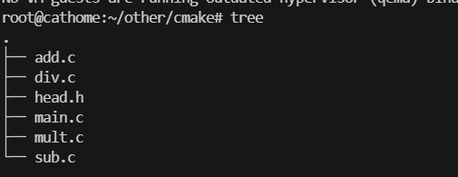

# CMAKE

## 概述

`CMAKE`是一个跨平台的项目构建工具。
关于项目构建我们所熟知的还有`Makefile`，大多数IDE都集成了`make`，但是`makefile`通常依赖于当前的编译平台，而且编写`makefile`的工作量比较大，解决依赖关系时容易出错。

而`CMAKE`允许开发者指定整个流程的编译流程，在根据编译平台，**自动地生成本地化的`Makefile`和工程文件，最后用户只需`make`编译即可。

总结，`CMAKE`的优点如下：
- 跨平台。
- 能够管理大型项目。
- 简化编译流程和编译过程。
- 可扩展：可以为`cmake`编写特定功能的模块，扩充`cmake`功能。


## 使用

`CMAKE`支持大写、小写以及混合大小写的命令。


### 注释

#### 注释行

`CMAKE`使用`#`进行**行注释**：
```cmake
# cmake最低要求版本
cmake_minimum_required(VERSION 3.0.0)
```

#### 注释块
`CMAKE`使用`#[[ ]]`进行块注释：
```cmake
#[[
    块注释
]]
cmake_minimum_required(VERSION 3.0.0)
```

### 只有源文件

#### 共处一室

- 准备以下源文件：


- 添加`CmakeLists.txt文件

文件内容如下：
```cmake
cmake_minimum_required(VERSION 3.0)  # 指定使用的 cmake 的最低版本
project(CALC) 
add_executable(app add.c sub.c div.c mult.c main.c)
```

`project`：定义工程名称，并可指定工程的版本、工程描述、web主页地址、支持的语言等。
```cmake
project(<PROJECT-NAME>[<language-name>...])
project(<PROJECT-NAME>
        [VERSION <major>[.<minor>[.<patch>[.<tweak>]]]]
        [DESCERIPTION <project-description-string>]
        [HOMEPAGE_URL <url-string>]
        [LANGUAGES <language-name>...])
```

`add_executable`：定义工程会生成一个可执行程序：
```cmake
add_executable(可执行程序 源文件名称)
```
源文件可以是一个或多个，可用空格或者分号（英文）隔开。

- 执行`cmake`命令
```bash
cmake CMakeLists.txt文件所在路径
```


执行`cmake`指令后，会出现许多文件，并且在对应的目录下生成了一个`makefile`文件，此时再执行`make`命令，就可以对项目进行构建得到所需的可执行程序。
```bash
make
```


#### VIP包房

我们可以把生成的这些与项目源码无关的文件放到一个对应的文件夹`build`中，

```bash
mkdir build

cd build

cmake ..

```


### 私人定制

#### 定义变量

在`cmake`里定义变量需要使用`set`：

```cmake
# SET 指令语法
# [] 中的参数为可选项
# VAR：变量名  VALUE：变量值
SET(VAR [VALUE] [CACHE TYPE DOCSTRING [FORCE]])
```

我们可以将上述源文件统一用一个变量名代替，如下：
```cmake
SET(SRC_LIST add.c sub.c main.c div.c mult.c)
add_executable(app $(SRC_LIST))
```


#### 指定使用的C++标准

在编写程序时，可能会用到C++11、C++14等新特性，那么就需要在编译的时候在命令中指定要使用哪个标准：
```bash
g++ *.cpp -std=c++11 -o app
```

而在`CMAKE`中指定C++标准有两种方式：
- 在`CMakeLists.txt`中通过`set`命令指定：

```cmake
# 指定使用cpp11
set(CMAKE_CXX_STANDARD 11)
```

- 在执行`cmake`命令时指定：

```bash
cmake CMakeLists.txt文件所在路径 -DCMAKE_CXX_STANDARD=11
```

#### 指定输出的路径

在`CMAKE`中指定可执行程序输出的路径，也对应一个宏，叫做`EXECUTABLE_OUTPUT_PATH`，其值通过`set`命令进行设置：
```cmake
# 定义一个变量用于存储绝对路径
set(HOME /root/other/cmake)

# 将拼接好的路径值设置给 EXECUTABLE_OUTPUT_PATH
# 如果该子目录不存在，会自动生成，无需自己手动创建
set(EXECUTABLE_OUTPUT_PATH ${HOME}/bin)
```

### 搜索文件

如果一个项目的源文件很多，在编写`CMakeLists.txt`文件的时候不可能将项目目录的各个文件一一罗列出来。因此，`CMAKE`中为我们提供了搜索文件的命令，可以使用`aux_source_directory`命令或者`file`命令。


#### 方式1

使用`aux_source_directory`命令可以查找某个路径下的所有源文件，命令格式为：
```cmake
# dir - 要搜索的目录
# variable - 将从 dir 目录下搜索到的源文件列表存储到该变量中
aux_source_directory(<dir> <variable>)
```

#### 方式2

```cmake
# GLOB - 将指定目录下搜索到的满足条件的所有文件名生成一个列表，并将其存储到变量中
# GLOB_RECURSE - 递归搜索指定目录，将搜索到的满足条件的文件名生成一个列表，并将其存储到变量中
file(GLOB/GLOB_RECURSE 变量名 要搜索的文件路径和文件类型)
```


### 包含头文件

```cmake
include_directories(headpath)
```


### 制作动态库或静态库

#### 制作静态库

```cmake
add_library(库名称 STATIC 源文件1 [源文件2] ...)
```

linux中，静态库名字分为三部分：`lib`+ 库名字 + `.a`。


#### 制作动态库

```cmake
add_library(库名称 SHARED 源文件1 [源文件2] ...)
```
linux中，动态库名字分为三部分：`lib`+ 库名字 + `.so`。


### 包含库文件

#### 链接静态库

```cmake
# 可以是全名 也可以只是库名字
link_libraries(<static lib> [<static lib>])
```

如果该静态库不是系统提供的，此时可以将静态库的路径也指定出来：
```
link_directories(<lib path>)
```

#### 链接动态库

```cmake
# target - 指定要加载的库文件的名字（源文件/动态库/静态库/可执行文件）
# PRIVATE|PUBLIC|INTERFACE - 默认为 PUBLIC
# 
target_link_libraries(
    <target>
    <PRIVATE|PUBLIC|INTERFACE> <item> ...
    [<PRIVATE|PUBLIC|INTERFACE> <item> ...] ...
    )
```

在`CMAKE`中指定要链接的动态库的时候，应将命令写到生成可执行文件之后。
