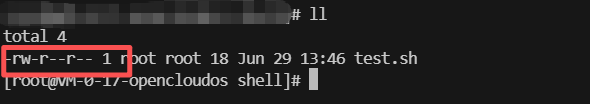
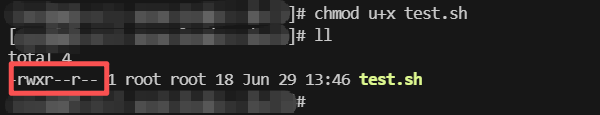
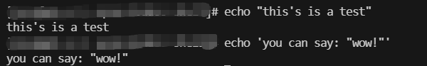
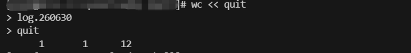

# shell 脚本编程基础


## 1. 构建基础脚本

## 1.1 shell 脚本文件


shell 脚本一般以 `.sh`为文件后缀，在创建 shell 脚本文件时，必须在文件的第一行指定要使用的 shell，格式如下：
```bash
#!/bin/bash
```

一般情况下，**shell 脚本中的 `#` 用作注释行**，shell 不会处理脚本中的注释行。
但是，shell 脚本中的**第一行是一个例外**。
`#`后面的**感叹号`!`会告诉 shell 用哪个 shell 来运行脚本**。

在指明了 shell 之后，可以在文件的各行输入命令，每行末尾加一个换行符。如下所示：
```bash
#!/bin/bash

# test.sh
date
```
执行报错：


我们需要让 bash shell 找到编写的脚本文件，可通过以下命令来查找：
```bash
echo $PATH
```

要让 shell 找到 test 脚本，我们有两种方法：
- 将放置 shell 脚本的目录**添加到 PATH 环境变量中**
- 在命令行中使用绝对路径或相对路径来引用 shell 脚本


这里我们采用第二种方法，执行继续报错：
```bash
./test.sh
```


这是因为，我们没有给予文件执行权限：




因此，使用`chmod`命令赋予文件拥有者执行文件的权限：




再次执行，完成：


## 1.2 显示消息`echo`


大多数 shell 命令会产生自己的输出，这些输出会显示在脚本所运行的控制台显示器上。

若想添加文本消息来告诉用户脚本正在做什么，可以通过`echo`命令来实现。
```bash
echo [messages]
```
默认情况下，**无需使用引号**将要显示的字符串划定出来。因为有时会产生错误：


`echo`命令可以通过单引号和双引号来划定字符串。**如果需要使用一种引号，那么就需要另外一种引号来划定字符串**，如下：




使用`echo -n`命令可以将字符串和命令输出显示在同一行：
```bash
#!/bin/bash

# echo_test.sh

echo -n "The time and date are: "
date
```


## 1.3 变量


### 1.3.1 环境变量

shell 维护着一组用于记录特定的系统信息的环境变量，如系统名称、已登录的用户名等。可以使用`set`命令显示一份完整的当前环境列表：
```bash
set
```

在脚本中，可以**在环境变量名之间加上`$`来引用这些环境变量**：

```bash
# 显示已登录用户的相关信息
echo $HOME 
echo $USER
echo $UID
```

如果要显示`$`字符，我们需要在其前加上`\`：
```bash
echo \$15
```


### 1.3.2 用户自定义变量

除了环境变量，脚本还**允许用户在文件中定义和使用自己的变量**。

用户自定义的变量可以是**任何字母、数字或下划线组成的字符串，长度不能超过 20 个字符，同时变量名区分大小写**。

shell 脚本以字符串的形式存储所有的变量值，脚本中的各个命令可以自行决定变量值的数据类型。

与系统变量类似，用户自定义变量可以通过`$`引用：
```bash
#/bin/bash
# var_demo.sh

name="lucy"  # 中间不能有空格
age=16
echo "$name is $age years old."
```

引用变量时要加`$`，对变量赋值时不需要加`$`。

```bash
#/bin/bash
# var_demo.sh

name="lucy"
age=16
echo "$name is $age years old."

name2="mike"
age2=$age # 不能是 age2=age
echo "$name2 is $age2 years old"
```


### 1.3.3 命令替换

shell 脚本可以**从命令输出中提取信息并将其赋给变量**。

有两种方式可以将命令输出赋给变量：
- 反引号（`）
- $()格式


```shell
#!/bin/bash

# command substitution

# 简单示例
time=$(date)
echo "The date and time are: " $time

# 获取当前日期并用其来生成唯一文件名

today=$(date +%y%m%d) # 将日期显示为两位数的年月日组合
# 将 /usr/bin 目录下的文件列表复制到日志文件中
ls /usr/bin -al > log.$today
```


## 1.4 重定向输入和输出

若想将命令的输出重定向到其他位置（如文件），则需用到重定向命令。

### 1.4.1 输出重定向

shell 使用**大于号（>）**来实现输出重定向：

```shell
#!/bin/bash
# 将日期输出到文件中
# 若文件不存在，则会创建并将 date 命令的输出重定向至该文件
# 若文件存在，则新数据会覆盖原有文件内容
date > outputfile
```

若想追加内容，则需用到**双大于号（>>）**：
```shell
#!/bin/bash
# 将 who 命令的输出追加至该文件
who >> outputfile
```

### 1.4.2 输入重定向

与输出重定向相反，输入重定向会将文件至命令，其使用**小于号（<）**实现输入重定向：
```bash
command < inputfile
```

示例：

```shell
#!/bin/bash
# wc 会统计文本数据
# 输出三个值： 文本的行数、单词数以及字节数
wc < inputfile
```

存在双大于号，那么也会存在**双小于号（<<）**，其称为**内联输入重定向**。

内联输入重定向无需指定文件进行重定向，但需指定一个文本标记来划分输入数据的起止，示例如下：
```shell
#!bin/bash

# 统计每个文本数据，直到输入quit后停止
wc << quit
```




## 1.5 管道

管道（|）可以将一个命令的输出作为另一个命令的输入。
> Linux系统会同时运行由管道连接的两个命令，当第一个命令产生输出时，它会被立即传给第二个命令。数据传输不会用到任何中间文件和缓冲区。


```bash
# 统计 date 的输出文本数据
date | wc

# 排序 rpm包列表的输出，并通过 more 显示
rpm -qa | sort | more
```


## 1.6 执行数学运算


### 1.6.1 expr 命令

expr 命令能够识别少量算术运算符和字符串运算符：

```bash
expr 5 + 3
```

但是对于某些符号（如 *），其会产生歧义，需通过转义字符对 * 进行转义：
```bash
expr 5 * 3 # error

expr 5 \* 3
```


### 1.6.2 方括号

为了更加方便执行数学运算，可以使用`$`和方括号($[operation])。

```shell
#/bin/bash

# 使用方括号进行数学运算（仅支持整数运算）

var1=4
var2=5

echo "sum: " $[$var1 + $var2]
echo "sub: " $[$var1 - $var2]
echo "mul: " $[$var1 * $var2]
echo "div: " $[$var1 / $var2]
```


### 1.6.3 浮点数

我们可以使用`bc`来进行浮点数预算：

```bash
bc
```

`bc`可以识别以下内容：
- 数字（整数和浮点数）
- 变量（简单变量和数组）
- 注释（以 # 开头或 /* */）
- 表达式
- 编程语句
- 函数

浮点数运算是由内建变量`scale`控制的，其表示计算结果中保留的小数位数：

```bash
bc
scale=4 # 保留四位小数
```

那么如何在脚本中使用`bc`呢？我们可以通过命令替换来运行`bc`命令。
```bash
# options 用于定义变量，可定义多个变量
# expression 指定特定运算
var=$(echo "options; expression" | bc)
```

示例如下：
```shell
#/!bin/bash

var1=$(echo "scale=4;v1=5;v2=6;v1/v2" | bc)
echo $var1
```


## 1.7 退出脚本


shell 中运行的每个命令都使用**退出状态码**来告诉 shell 自己已经运行完毕。退出状态码是一个 0~255 的整数值，在命令结束运行时由其传给 shell。

### 1.7.1 查看退出状态码

Linux 提供了专门的变量`$?`来保存最后一个已执行命令的退出状态码。
```bash
date

# 对于成功结束的命令，其退出状态码为0，否则为正整数
echo $?
```

### 1.7.2 exit 命令

`exit`命令允许在脚本结束时指定一个退出状态码。

```shell
#!/bin/bash

date

exit 5
```


### 1.8 实战演练

编写一个 shell 脚本来计算两个日期之间相隔的天数。

```shell
#!/bin/bash

date1="Jan 9, 2024"
date2="May 4, 2025"

# -d 选项指定特定日期
# 获取从1970年1月1日后到当前日期的整数秒
time1=$(date -d "$date1" +%s)
time2=$(date -d "$date2" +%s)

# 做差 和 整除一天的描述
diff=$(expr $time2 - $time1)
secondsinday=$[24 * 60 * 60]
days=$[$diff / $secondsinday]

echo "日期相差: " $days "天"
```

## 2. 结构化命令

### 2.1 if-then 语句

`if-then`语句的结构如下：
```bash
if command
then
    commands
fi
```

`if`语句会执行`if`之后的语句，如果该命令执行成功（退出状态码为0），那么`then`语句部分的命令就会被执行。`fi`语句用来表示`if-then`语句到此结束。


```shell
#!/bin/bash

if date
then
    echo "日期输出成功"
fi
```


### 2.2 if-then-else 语句

与`if-then`不同的是，在退出状态码不为 0 时，不会直接退出，而是执行`else`语句部分的命令。其结构如下：
```bash
if command
then
    commands
else
    commands
fi
```

示例：判断用户是否存在：

```shell
#!/bin/bash

testuser=NoSuchUser

if grep $testuser /etc/passwd
then
    echo "用户$testuser目录下的文件有:"
    ls /home/$testuser/*
    echo
else
    echo "用户$testuser不存在该系统"
    echo
fi
```


### 2.3 嵌套 if 语句


有时需要在脚本中检查多种条件。对此，可以使用嵌套的`if-then`语句。
```shell
#!/bin/bash

testuser=NoSuchUser

if grep $testuser /etc/passwd
then
    echo "用户$testuser目录下的文件有:"
    ls /home/$testuser/*
    echo
else
    echo "用户$testuser不存在该系统"
    if ls -d /home/$testuser/
    then
        echo "用户$testuser有文件夹"
    fi
    echo
fi
```


同时，也可以使用`elif`语句来延续`else`部分：

```shell
#!/bin/bash

testuser=NoSuchUser

if grep $testuser /etc/passwd
then
    echo "用户$testuser目录下的文件有:"
    ls /home/$testuser/*
    echo
elif ls -d /home/$testuser/
then
    echo "用户$testuser不存在该系统"
    echo "用户$testuser有文件夹"
fi
```


### 2.4 test 命令

`test`命令可以在`if-then`语句中测试不同的条件。

如果`test`命令中列出的条件成立，那么`test`命令就会退出并返回退出状态码0。

其格式如下：
```bash
test condition
```
如果不写`test`命令的`condition`部分，那么它会以非 0 的退出状态码退出。

`test`命令可以判断三类条件：
- 数值比较
- 字符串比较
- 文件比较


#### 2.4.1 数值比较

| 比较 | 描述 |
| - | - |
| n1 -eq n2 | 是否相等 |
| n1 -ge n2 | 是否大于等于 |
| n1 -gt n2 | 是否大于 |
| n1 -le n2 | 是否小于等于 |
| n1 -lt n2 | 是否小于 |
| n1 -ne n2 | 是否不等于 |


#### 2.4.2 字符串比较

大于号和小于号在使用时需要**转义**。比较大小通过 Unicode 编码值来决定排序结果。

| 比较 | 描述 |
| - | - |
| str1 = str2 | 是否相同 |
| str1 != str2 | 是否不同 |
| str1 < str2 | 是否小于 |
| str1 > str2 | 是否大于 |
| -n str1 | 检查 str1 的长度是否不为 0 | 
| -z str1 | 检查 syr1 的长度是否为 0 |

#### 2.4.3 文件比较

| 比较 | 描述 |
| - | - |
| -d file | file 是否存在且为目录 |
| -e file | file 是否存在 |
| -f file | file 是否存在且为文件 | 
| -r file | file 是否存在且可读 |
| -s file | file 是否存在且非空 |
| -w file | file 是否存在且可写 | 
| -x file | file 是否存在且可执行 | 
| -O file | file 是否存在且属当前用户所有 |
| -G file | file 是否存在且默认组与当前用户相同 |
| file1 -nt file2 | file1 是否比 file2 新 |
| file1 -ot file2 | file1 是否比 file2 旧 |


### 2.5 符合条件测试

`if-then`语句允许使用布尔逻辑将测试条件组合起来，可以使用以下两种布尔运算符：
- [condition1] && [condition2]
- [condition1] || [condition2]


- and 布尔运算符示例

```shell
#!/bin/bash

filename="test"
if [ -d $HOME ] && [ -w $HOME/$filename ]
then
    echo "文件存在并且可写"
else
    echo "文件不可写"
fi
```


### 2.6 if-then 的高级特性

- 在子 shell 中执行命令的单括号
- 用于数学表达的双括号
- 用于高级字符串处理功能的双方括号


#### 2.6.1 使用单括号

命令格式如下：
```bash
(command)
```

在 bash shell 执行命令之前，会先创建一个子 shell，然后在其中执行命令。如果命令成功，则退出状态码会被设为 0。

```shell
#!/bin/bash

echo $BASH_SUBSHELL

if (echo $BASH_SUBSHELL)
then
        echo "子shell命令执行成功"
else
        echo "子shell命令执行失败"
fi
```


